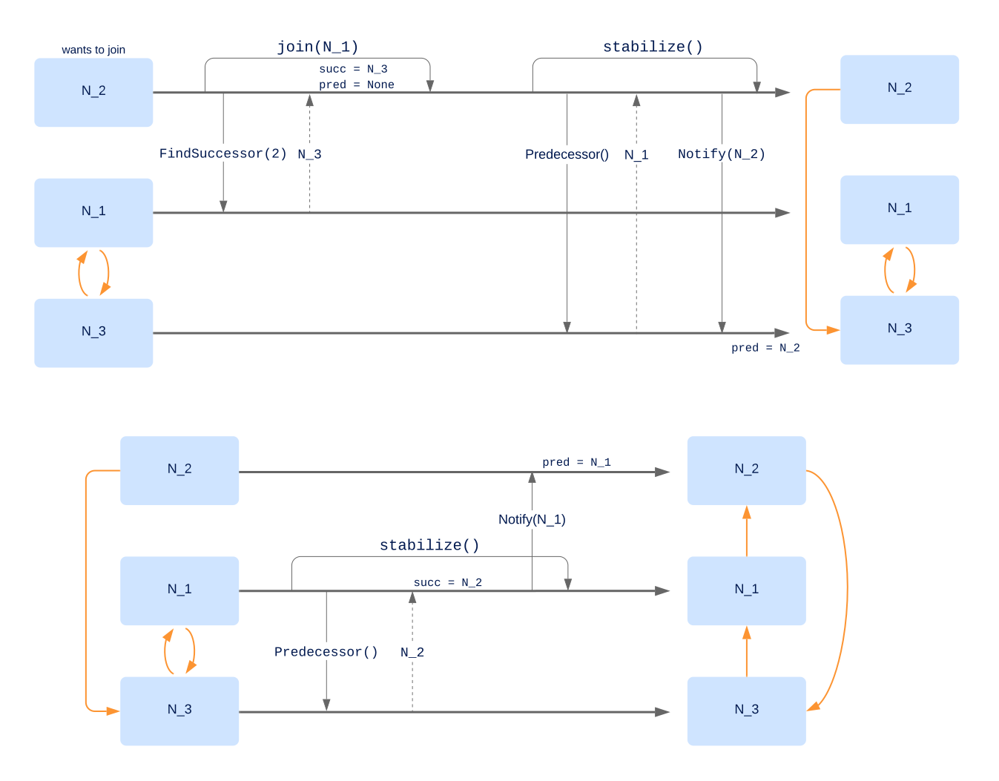
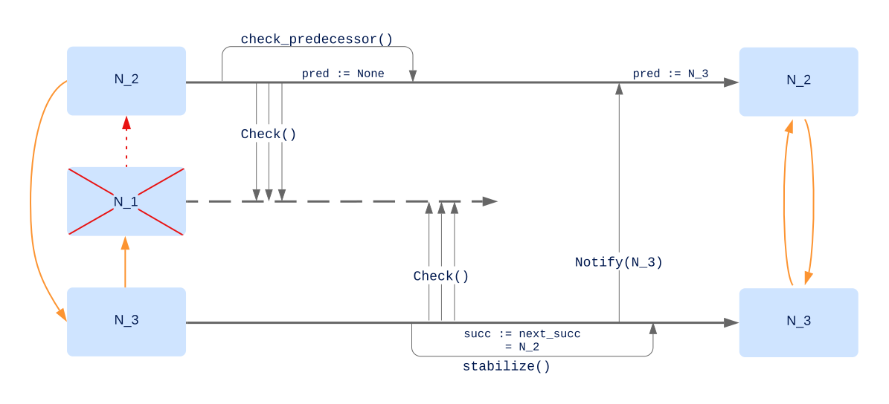

# Sistema Dinámico

Este documento describe cómo se logra mantener el sistema en funcionamiento incluso ante el ingreso y egreso de nodos.

El invariante a mantener es que toda clave que haya sido agregada al sistema se pueda encontrar en algún nodo.

## Unión

En el siguiente diagrama se muestra de forma simplificada cuál es el proceso de unión de un nodo (en este caso `N_2`) a un anillo ya formado.

Asumamos tres nodos `N_1`, `N_2` y `N_3` con IDs 1, 2 y 3 respectivamente, tal que `N_1` y `N_3` forman parte de un anillo al cual `N_2` va a unirse.

### 1. `N_2.join()`

`N_2` comienza ejecutando el método `join`, especificando un nodo que ya forme parte del anillo (`N_1`).
`N_2` le pide a `N_1` que busque el nodo sucesor del id `2`. `N_2` asigna al nodo resultante como su sucesor.

### 2. `N_2.stabilize()`

Cuando eventualmente `N_2` ejecute el método periódico `stabilize()` le pedirá a su sucesor `N_3` que le informe su predecesor (en este punto es `N_1`). `N_2` reconoce que su sucesor sigue siendo `N_3` (ya que `N_1` claramente no debe ser su sucesor) por lo que ejecuta el método `Notify()` sobre `N_3`, pasándose a sí mismo como argumento. Esto causa que `N_3` reconozca que su nuevo predecesor debe ser `N_2` y actualiza el campo correspondiente.

Eventualmente el nodo `N_1` ejecutará `stabilize()`.
Le pedirá a su sucesor `N_3` que le informe su predecesor (ahora `N_2`).
Aquí, `N_1` reconoce que `N_2` está dentro del rango entre los IDs de `N_1` y `N_3`, por lo que actualiza su campo sucesor con `N_2` y ejecutará sobre este el método `Notify(N_1)`, causando que `N_2` actualice su campo predecesor con `N_1`.

## Salida

Veamos ahora qué ocurre cuando un nodo abandona el anillo. Esto puede ser voluntariamente o por una falla.

Asumimos que el sistema tiene tolerancia a al menos una falla. Esto implica que cada nodo lleva una lista de al menos dos sucesores.

En este caso, quien abandona el anillo es el nodo `N_1`.

El nodo `N_2`, periodicamente, ejecuta `check_predecessor()` para comprobar el estado de su predecesor.
Al no recibir respuesta luego de un número de intentos, asume una falla y elimina la referencia.

Por otro lado, durante una de las llamadas a `stabilize()`, `N_3` comprobará el estado de su sucesor. De la misma manera, luego de un número de peticiones sin respuesta, asume una falla y asigna al próximo sucesor de la lista como su sucesor (en este caso `N_2`).
Luego, ejecutará `Notify(N_3)` sobre su nuevo sucesor, y como `N_2` había quedado sin predecesor, lo asigna a `N_3`.

